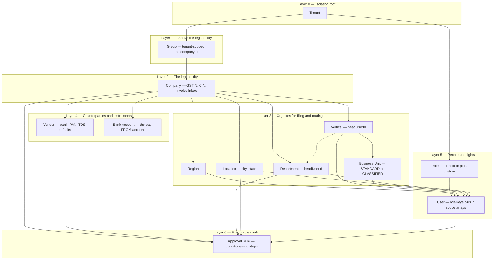
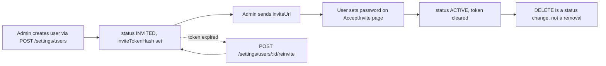
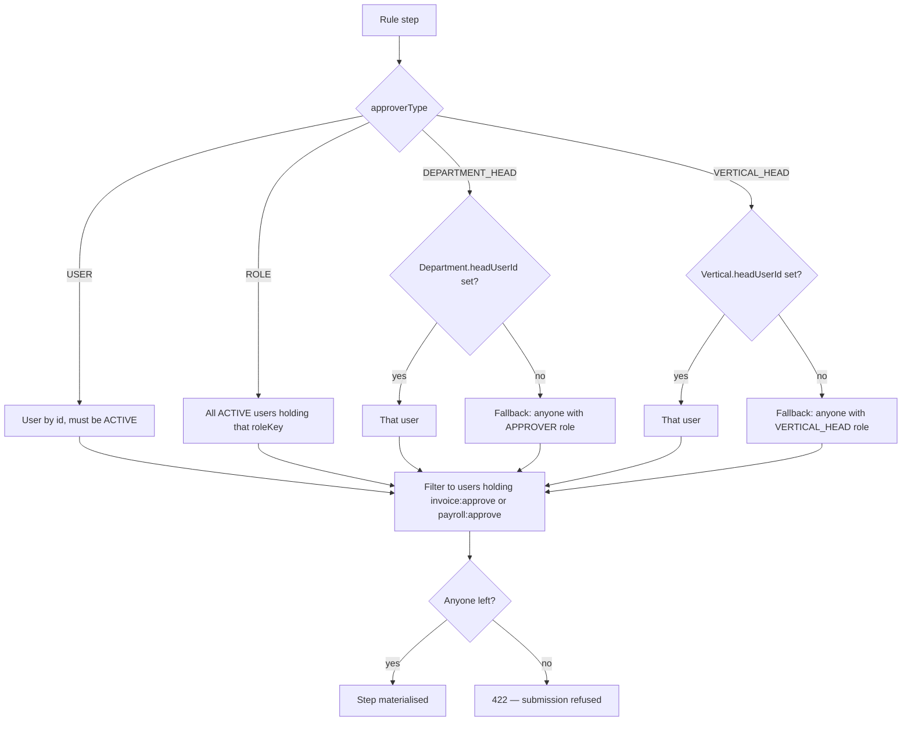
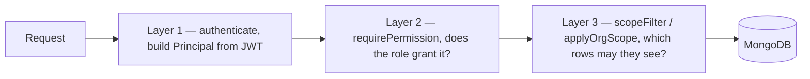
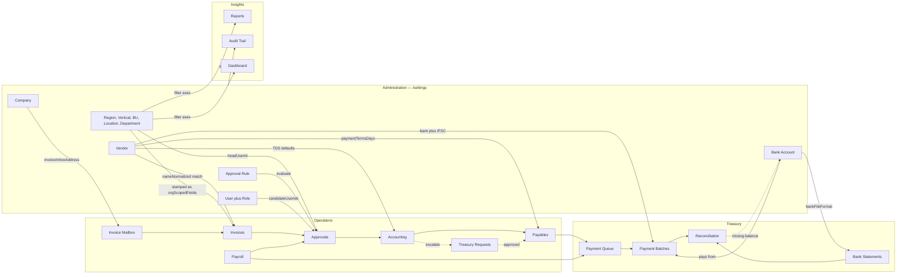
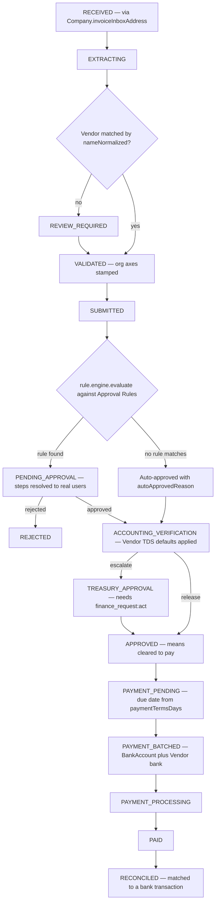
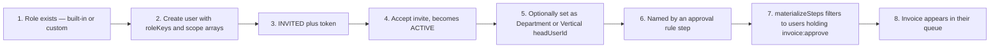

# Administrative Modules — Purpose, Connectivity & Flow Map

> Ground truth: read from source on branch `dev`. Every claim below cites the file it came from.

---

## 1. The one-paragraph model

FPC has **12 administrative screens**, all under `/settings`. Eleven of them are *masters* — reference
data that exists so that operational documents (invoices, payments, payroll) have something to point at.
The twelfth, **Approval Rules**, is the only one that is *executable configuration*: it turns the other
masters into a routing decision about who must sign off on money leaving the company.

The whole administrative surface exists to answer three questions about every rupee:

| Question | Answered by |
|---|---|
| **Whose money is this?** | Tenant → Group → Company |
| **Who may see and touch it?** | Users + Roles + the six org scope axes |
| **Who must approve it?** | Approval Rules, keyed on Vendor / Department / Vertical / Location / Region / Business Unit |

---

## 2. Two invariants to internalise first

These two rules explain most of the surprising behaviour in the system.

### 2.1 Nothing is ever hard-deleted

`DELETE /settings/<master>/:id` sets `active: false`. It never removes the row.

```ts
// apps/server/src/modules/organization/crudFactory.ts
// Soft delete: financial records reference these, so rows are
// deactivated rather than removed.
await config.model.findByIdAndUpdate(existing._id, { active: false });
```

The audit event is `<name>.deactivated`, not `.deleted`. A three-year-old invoice must still be able to
render its vendor and department names.

### 2.2 An empty scope array means UNRESTRICTED, not "none"

This is the single most counter-intuitive rule in the codebase.

```ts
// apps/server/src/models/user.model.ts:11
// Organisation scope. Empty on an axis means "unrestricted on that axis" —
// `companyIds: []` is how a platform admin reaches every company.
```

```ts
// apps/server/src/middleware/tenantScope.ts:20
} else if (principal.companyIds.length > 0) {
  // An empty companyIds list means tenant-wide access (platform/company admin).
  filter.companyId = { $in: principal.companyIds };
}
```

Consequences:

- A brand-new user with every scope array empty can see **the entire tenant**, limited only by permissions.
- Restricting someone means *adding* ids, not removing them.
- The converse: a user scoped to a vertical sees **only documents that carry a `verticalId`**. A document
  with a null axis is invisible to anyone restricted on that axis — which is why the seed sets every axis
  it can.

---

## 3. The 12 modules at a glance

| # | Screen | API base | Model | Built by | Scoping | Read permission |
|---|---|---|---|---|---|---|
| 1 | Companies | `/settings/companies` | `company.model.ts` | **bespoke** | tenant + own id list | `company:read` |
| 2 | Groups | `/settings/groups` | `group.model.ts` | crudFactory | **tenant only** | `group:read` |
| 3 | Regions | `/settings/regions` | `region.model.ts` | crudFactory | company + `selfScopeAxis: regionId` | `region:read` |
| 4 | Verticals | `/settings/verticals` | `vertical.model.ts` | crudFactory | company + `selfScopeAxis: verticalId` | `vertical:read` |
| 5 | Business Units | `/settings/business-units` | `businessUnit.model.ts` | crudFactory | company + `businessUnitId` + **CLASSIFIED filter** | `business_unit:read` |
| 6 | Locations | `/settings/locations` | `location.model.ts` | crudFactory | company + `selfScopeAxis: locationId` | `location:read` |
| 7 | Departments | `/settings/departments` | `department.model.ts` | crudFactory | company + `selfScopeAxis: departmentId` | `department:read` |
| 8 | Vendors | `/settings/vendors` | `vendor.model.ts` | crudFactory | company only | `vendor:read` |
| 9 | Bank Accounts | `/settings/bank-accounts` | `bankAccount.model.ts` | crudFactory | company only | `bank_account:read` |
| 10 | Users | `/settings/users` | `user.model.ts` | **bespoke** | tenant | `user:read` |
| 11 | Roles | `/settings/roles` | `role.model.ts` | **bespoke** | tenant | `role:read` |
| 12 | Approval Rules | `/settings/approval-rules` | `approvalRule.model.ts` | **bespoke** | company | `approval_rule:read` |

Mount points: `apps/server/src/app.ts:60-61`. Note `/settings/approval-rules` is registered *before*
`/settings`, so it wins the prefix match.

---

## 4. Layer map



Solid = hard containment (a `required` foreign key). Dotted = optional (`Department.verticalId` is optional).

---

## 5. Module by module

### 5.1 Company — the legal entity

**Use.** One row per company that actually issues payments. Everything financial carries a `companyId`;
this is the row that defines it.

**Model** (`apps/server/src/models/company.model.ts`):
`groupId?`, `name`, `legalName?`, `gstin?`, `cin?`, `invoiceInboxAddress?`, `baseCurrency: 'INR'`, `active`.

**Why it is bespoke rather than crudFactory** — `company.routes.ts:18`:

> Companies are scoped by the principal's company list rather than by a `companyId` filter — this is the
> collection that defines that list.

It filters on `_id: { $in: principal.companyIds }`, not `companyId`. The generic factory cannot express that.

**Real use case.** "Nova Group" runs two legal entities — Nova Engineering Pvt Ltd (GSTIN `33AABC…`,
Tamil Nadu) and Nova Technologies Pvt Ltd (GSTIN `29AABC…`, Karnataka). They file separate GST returns and
hold separate bank accounts, but the CFO wants one login and one consolidated dashboard.

**`invoiceInboxAddress`** is the shared mailbox the platform polls for inbound vendor invoices — the entry
point of the whole invoice pipeline. Indexed sparsely so an inbound mail can be resolved to a company.

---

### 5.2 Group — the only level above the company

**Use.** Lets a CFO see two legal entities as one portfolio.

**What makes it unique.** It is the only master with **no `companyId`**:

```ts
// apps/server/src/modules/organization/index.ts
// A group sits above the legal entity, so it has no company of its own.
tenantScoped: true,
```

```ts
// apps/server/src/models/group.model.ts:5
// The only organisation level that sits *above* the legal entity, so it is
// scoped to the tenant and deliberately does not use `scopedFields()`.
```

**Fields.** `tenantId`, `name`, `code` (unique per tenant), `active`.

**Use case.** Group-level consolidated reporting; a group-scoped user sees every company beneath it.

---

### 5.3 Region

**Use.** Geographic filing axis. `{ name, code, active }` — deliberately thin.

**Use case.** "Show me South region spend across both companies." Also usable as an approval-rule condition
(`field: 'regionId'`).

---

### 5.4 Vertical — the first rung of the approval ladder

**Fields.** `name`, `code`, **`headUserId?`**, `active`.

`headUserId` is the important one:

```ts
// apps/server/src/models/vertical.model.ts:10
/** Resolved by VERTICAL_HEAD approval steps, mirroring Department.headUserId. */
headUserId?: Types.ObjectId;
```

This is what makes Verticals *operational* rather than merely descriptive — an approval rule step of type
`VERTICAL_HEAD` reads this field to find a person.

**Use case.** Technology vertical and Operations vertical inside Nova Engineering. The Technology head
signs off Technology spend; the ladder is enforced by the *user's vertical scope*, not by extra permissions
— in `permissions.ts` the `VERTICAL_HEAD` grants are literally `[...APPROVER]`.

---

### 5.5 Business Unit — the only master with a visibility discriminator

**Fields.** `verticalId` (**required**), `name`, `code`, `kind: STANDARD | CLASSIFIED`, `active`.

This is the one master with a genuine access-control twist:

```ts
// apps/server/src/modules/organization/index.ts
// A classified unit is reachable only by naming it in your own scope, so
// holding the vertical above it is not enough.
extraScope: (principal) =>
  principal.businessUnitIds.length > 0 || principal.permissions.includes('business_unit:update')
    ? {}
    : { kind: BusinessUnitKind.STANDARD },
```

**Read it carefully — it is subtle.** The `STANDARD`-only filter applies to a principal who is *unrestricted*
on the business-unit axis **and** lacks `business_unit:update`. Someone who holds the Technology vertical but
no explicit business-unit grant sees Platform but **not** "Strategic Projects". Administrators who maintain
the master keep seeing classified rows, "or they could not be edited at all".

It also supports `buildFilter: (q) => q.verticalId ? { verticalId: q.verticalId } : {}` — the only master
with a parent-based query filter.

**Use case.** An M&A or confidential-projects unit whose invoices must not appear in a normal vertical head's
queue.

---

### 5.6 Location

**Fields.** `name`, `code`, `city?`, `state?`, `active`.

**Note.** `state` is stored but the code carries no GST place-of-supply logic keyed off it — it is a filing
and filtering dimension, and a valid approval-rule condition (`field: 'locationId'`).

**Gotcha from the seed** (`data.org.ts`): location codes repeat across companies on purpose — both
companies have a Bengaluru `BLR`. Uniqueness is `{ tenantId, companyId, code }`, so every lookup must be
company-qualified.

---

### 5.7 Department — cost centre and approval anchor

**Fields.** `verticalId?` (optional), `name`, `code`, **`headUserId?`**, `active`.

```ts
// apps/server/src/models/department.model.ts:12
/** Resolved by DEPARTMENT_HEAD approval steps (PRD §15). */
headUserId?: Types.ObjectId;
```

**Use case.** IT raises a ₹35L invoice; the ₹1L–₹10L and >₹10L ladders both begin with `DEPARTMENT_HEAD`,
which resolves to `Department.headUserId`. Departments outside finance originate invoices too — HR and
Administration are seeded precisely to prove that.

---

### 5.8 Vendor — the counterparty master

The richest master. `apps/server/src/models/vendor.model.ts`:

| Group | Fields |
|---|---|
| Identity | `code` (unique per company), `name`, `nameNormalized`, `email?`, `phone?` |
| Tax | `gstin?`, `pan?`, `tdsApplicable`, `tdsSection?`, `tdsRateBasisPoints?` |
| Payment | `bankAccountNumber?`, `ifsc?`, `beneficiaryName?`, `paymentTermsDays` (default 30) |
| Lifecycle | `status: ACTIVE \| INACTIVE \| BLOCKED` |

**`nameNormalized`** is maintained by a `pre('validate')` hook and indexed. It exists to resolve a *free-text
vendor name extracted from a PDF* back to a vendor row — the join between OCR output and the master.

**`code`** is auto-derived when absent: first 8 characters of the normalised name plus a base-36 suffix
(`deriveVendorCode` in `organization/index.ts`).

**TDS.** `tdsApplicable` / `tdsSection` / `tdsRateBasisPoints` are **defaults only**:

```ts
// apps/server/src/models/vendor.model.ts:18
// Whether TDS is withheld from this vendor's invoices by default. Only a
// default: the accounting team decides per invoice and can override it.
```

Rates are **integer basis points** — 10% is `1000`, never a float.

**Use case.** Onboard a supplier before you can pay them. Set `status: BLOCKED` to stop new spend without
destroying the history of what you already paid them.

---

### 5.9 Bank Account — the accounts you pay *from*

**Fields.** `label`, `bankName`, `accountNumber`, `ifsc`, `currentBalance` (minor units),
`balanceAsOf?`, `bankFileFormat: HDFC | ICICI | GENERIC_CSV | GENERIC_XLSX`, `active`.

**Do not confuse three different "bank" things:**

| Thing | Where | What it is |
|---|---|---|
| `BankAccount` | **admin master** | *Your* account. Configured once. |
| `Vendor.bankAccountNumber` | vendor master | *Their* account. Where money goes. |
| `banking.model.ts` | operational | Imported statements and transactions. |

`bankFileFormat` is the connective tissue: it tells the banking importer which parser to use for statements
uploaded against this account. `currentBalance` is "refreshed from the closing balance of imported
statements" — so the admin master is *written back to* by the operational module.

`bankAccountRouter` is the only crudFactory master with a custom `label:` and `defaultSort: { label: 1 }`,
because it has no `name` field.

---

### 5.10 Users

**Fields** (`user.model.ts`): `name`, `email`, `passwordHash` (`select: false`), `roleKeys: string[]`,
seven scope arrays (`companyIds`, `groupIds`, `regionIds`, `verticalIds`, `businessUnitIds`, `locationIds`,
`departmentIds`), `status: ACTIVE | INVITED | SUSPENDED`, `lastLoginAt?`, `refreshTokenHashes`,
`inviteTokenHash?`, `inviteTokenExpiresAt?`.

**Lifecycle.**



An `INVITED` account **cannot sign in** — the hashed single-use token is the only path to a usable account.

**`roleKeys` is deliberately not an enum**: a tenant's own roles are rows, so assignment is validated in the
route against `knownRoleKeys()` rather than by Mongoose.

**Use case.** "Priya heads the IT department in Chennai." → `roleKeys: ['APPROVER']`,
`departmentIds: [IT]`, `locationIds: [Chennai]`, and `Department(IT).headUserId = Priya`. The role grants
the *right*; the scope arrays bound the *reach*; the `headUserId` puts her in the approval chain.

---

### 5.11 Roles — the permission catalogue

Two kinds coexist and are enforced identically.

**Built-in (in code, read-only).** 11 keys in `packages/shared/src/enums.ts:10`:

`PLATFORM_ADMIN` · `COMPANY_ADMIN` · `FINANCE_EXECUTIVE` · `FINANCE_MANAGER` · `APPROVER` ·
`VERTICAL_HEAD` · `ACCOUNTS_TEAM` · `TREASURY` · `CFO` · `PAYROLL_USER` · `AUDITOR`

> ⚠️ **Doc drift worth fixing.** Comments in `role.model.ts:8`, `role.routes.ts:18` and `data.org.ts` all
> say "the eight roles of PRD §7" / "the eight built-ins". `ROLE_PERMISSIONS` actually has **11** entries.
> `VERTICAL_HEAD`, `ACCOUNTS_TEAM` and `TREASURY` were added by commit `28163dd` and the comments were not
> updated.

**Custom (rows).** `Role` = `{ tenantId, key, label, description?, permissions[], active }`.
Guardrails in `role.routes.ts`:

- Key is derived from the label if absent (`"Payments Clerk"` → `PAYMENTS_CLERK`).
- `isSystemRoleKey(key)` → 409. You cannot shadow a built-in.
- Duplicate key → 409.
- `userCount` is returned by `GET /settings/roles` "to explain why a role cannot be deleted".
- Every write calls `invalidateRoleCache(tenantId)`.

**Resolution** (`role.service.ts`) short-circuits the DB entirely when every role is built in — the common
case. Custom grants are cached for 30 s, with write-through invalidation.

**The fail-safe** (`permissions.ts`):

> anything not found in either map grants nothing, so a role deleted out from under a user silently
> **narrows** their access instead of widening it.

**Separation-of-duty decisions encoded in the grants** — these are the interesting bits:

| Rule | Effect |
|---|---|
| `ACCOUNTS_TEAM` holds `invoice:verify`, **never** `invoice:approve` | Accounting cannot substitute for business sign-off |
| `FINANCE_EXECUTIVE` prepares but never approves | No `invoice:approve`, no `payroll:*` |
| `TREASURY` is read-only everywhere except `finance_request:act` | "Treasury sees the position and the evidence, and the only thing it can change is a request's outcome" |
| `COMPANY_ADMIN` gets `finance_request:read_all` but **not** `finance_request:act` | "Watches Treasury requests, never decides one" |
| `COMPANY_ADMIN` cannot create invoices, so never gets `mail_connection:manage` | "It can watch the connectors, not run them" |
| `AUDITOR` = every `:read` **except** `mail_connection:read_all` | Reading colleagues' mail subjects is a privacy decision made per role, not by naming convention |
| Payroll permissions are a separate namespace | Salary data invisible to AP users |

---

### 5.12 Approval Rules — the only executable admin config

```ts
// apps/server/src/models/approvalRule.model.ts:6
// An approval rule is data, not code (PRD §15).
// The PRD's ₹1L / ₹1L–₹10L / >₹10L ladder ships as seeded rows rather than
// branching logic, so an administrator can change the thresholds or the
// approver chain without a deployment.
```

**Shape.** `{ companyId, name, description?, appliesTo, priority, active, conditions[], steps[] }`

- **`appliesTo`**: `VENDOR_INVOICE` | `PAYROLL_BATCH` — only two subject types exist.
- **`conditions[]`**: `{ field, operator, value }`
  - fields: `amount`, `currency`, `vendorId`, `departmentId`, `locationId`, `regionId`, `verticalId`,
    `businessUnitId`, `employeeCount`
  - operators: `eq` `ne` `gt` `gte` `lt` `lte` `in` `nin` `between`
- **`steps[]`**: `{ order, approverType, roleKey?, userId?, label?, slaHours? }`
  - `approverType`: `ROLE` | `USER` | `DEPARTMENT_HEAD` | `VERTICAL_HEAD`

**Notice that the condition fields are precisely the administrative masters.** That is the reason the org
hierarchy exists at all — it is the vocabulary the routing engine speaks.

**Selection** (`rule.engine.ts`) — pure, no DB, no clock, no Mongoose, so the boundary cases are directly
unit-testable:

1. Filter to `active && appliesTo matches && every condition passes`
2. Highest `priority` wins
3. Tie → more conditions (more specific) wins
4. Tie → alphabetical by name, so the outcome is deterministic

`between` is **inclusive of the lower bound, exclusive of the upper**, "so adjacent bands like [0, 1L) and
[1L, 10L) cannot both claim ₹1,00,000."

**Approver resolution** (`approval.service.ts`) — this is where admin config becomes real people:



The two fallbacks differ on purpose. A headless *department* falls back to the generic `APPROVER` pool; a
headless *vertical* falls back to people who head a vertical somewhere, "rather than to the generic approver
pool — the point of the step is that a vertical owner signs off."

**It fails loudly, and this is the most important operational consequence of admin misconfiguration:**

```ts
// approval.service.ts
// A step with no eligible approver is a configuration error that would strand
// the invoice, so it fails loudly here rather than silently skipping a level
// of oversight.
```

Two distinct 422 messages: one for "names approvers who do not hold `invoice:approve`, so nobody could ever
action it", one for "has no eligible approver in this company."

**Eligibility across companies** (`approval.service.ts`): a candidate must have `companyIds` containing the
invoice's company **or** be empty — "a user scoped to no company is tenant-wide and eligible everywhere."

**The seeded ladder** (`seed/data.approvals.ts`), Nova Engineering:

| Priority | Band | Chain |
|---|---|---|
| 10 | ≤ ₹1L | Finance Manager |
| 20 | ₹1L – ₹10L | Department Head → Finance Manager |
| 30 | > ₹10L | Department Head → Finance Head → CFO |

---

## 6. The shared machinery — `crudFactory.ts`

Eight of the twelve masters are one config object each. The rationale is explicit:

```ts
// crudFactory.ts:23
// The point is that tenant/company scoping, permission gating and audit
// writing are applied uniformly and cannot be forgotten in one resource — not
// to abstract away anything with real domain behaviour, which each get their
// own hand-written module.
```

**Generated routes** (identical for all eight):

| Route | Permission | Behaviour |
|---|---|---|
| `GET /` | `<name>:read` | Paginated; `?q=` regex on `name` (escaped), `?sort` `?order` `?page` `?pageSize` `?companyId` |
| `GET /:id` | `<name>:read` | 404 if outside scope — *never* 403, so you cannot probe for existence |
| `POST /` | `<name>:create` | `resolveWriteCompany` → `beforeCreate` hook → create → audit |
| `PATCH /:id` | `<name>:update` | Scope-check → update → audit with **before/after diff of the changed keys only** |
| `DELETE /:id` | `<name>:delete` | `active: false` + `<name>.deactivated` audit |

**Config surface** — `model`, `entityType`, `name`, `permissions{read,create,update,delete}`,
`createSchema`, `updateSchema`, `tenantScoped?`, `selfScopeAxis?`, `extraScope?`, `listQuerySchema?`,
`buildFilter?`, `beforeCreate?`, `defaultSort?`, `label?`.

**`selfScopeAxis` — why it exists** (`crudFactory.ts`):

> A location row *is* a location, so it is narrowed by its own `_id` against the principal's grant for that
> axis rather than by a `locationId` field it does not have. Masters that merely belong to a company —
> vendors, bank accounts, approval rules — leave this off.

**Audit redaction** (`crudFactory.ts`) — `password`, `passwordHash`, `refreshTokenHashes` are stripped;
`bankAccountNumber` and `accountNumber` are masked to the last 4 digits before they reach the audit trail.

---

## 7. RBAC — three layers



```ts
// tenantScope.ts:7
// Layer 3 of access control: data scoping.
// Every read and write goes through one of these helpers, so a service that
// simply forgets to filter cannot return another tenant's — or another
// company's — documents.
```

**The six org axes** map document field → principal field:

| Document field | Principal field |
|---|---|
| `groupId` | `groupIds` |
| `regionId` | `regionIds` |
| `verticalId` | `verticalIds` |
| `businessUnitId` | `businessUnitIds` |
| `locationId` | `locationIds` |
| `departmentId` | `departmentIds` |

`companyId` is excluded on purpose — "it is also the write target and the switcher's subject", so it has its
own helpers (`assertCompanyAccess`, `resolveWriteCompany`).

**Requested filters are not taken on trust.** `assertOrgUnitAccess` runs on every caller-supplied axis value:

```ts
// tenantScope.ts
// Replaces the earlier `applyLocationScope`, which took the requested location
// on trust: a user scoped to one location could read another simply by naming
// it in the query string.
```

Forbidden axis access returns **403, not 404** — "so the caller learns it is a permission problem, not a
typo". Note this differs from `crudFactory`'s `GET /:id`, which returns 404 for out-of-scope rows. The
distinction is deliberate: the axis helpers answer "may you filter by this?", the row fetch answers "does
this exist for you?".

**How scope reaches documents.** It is denormalised, not joined (`base.ts`):

> Optional, indexed, and denormalised rather than reached through parent links: `applyOrgScope` narrows a
> query with a flat `$in` on these fields, so scoping never needs a join or a `$graphLookup`.

Models carrying all six axes via `orgScopedFields()`: **Invoice, FinanceRequest, ApprovalRequest,
PaymentObligation**. These are exactly the documents a scoped user needs to filter.

---

## 8. Connectivity — admin config → operational modules



### What each operational module needs, and what breaks without it

| Module | Requires | Failure mode if missing |
|---|---|---|
| Invoice Mailbox | `Company.invoiceInboxAddress` | Inbound mail cannot be resolved to a company |
| Invoices | Vendor (`nameNormalized`), org axes | Extracted vendor name will not resolve; a null axis makes the invoice invisible to scoped users |
| Approvals | **Approval Rule** + users holding the named role + `headUserId` | **422 on submit** — the invoice cannot be submitted at all |
| Accounting | `Vendor.tdsSection` / `tdsRateBasisPoints` | TDS must be entered by hand every time |
| Treasury Requests | A user with `TREASURY` role (`finance_request:act`) | Escalated requests have nobody to decide them |
| Payables | `Vendor.paymentTermsDays` | Due dates cannot be derived |
| Payment Batches | Vendor bank details + `BankAccount` | No beneficiary, or no account to pay from |
| Bank Statements | `BankAccount.bankFileFormat` | Wrong parser selected for the upload |
| Reconciliation | `BankAccount` | Nothing to reconcile against |
| Payroll | Approval rule with `appliesTo: PAYROLL_BATCH` + a `payroll:approve` holder | Batch cannot be submitted |
| Reports / Dashboard | Org axes | Filters return empty |

---

## 9. Lifecycle flow maps

### 9.1 Invoice → payment



The critical design point at the `PENDING_APPROVAL → ACCOUNTING_VERIFICATION` edge
(`approval.dispatcher.ts`):

> Business sign-off is recorded on `approvalStatus`; the invoice status now moves to accounting rather than
> to APPROVED, because **APPROVED means cleared to pay** and accounting has not seen it yet.

So `approvalStatus` and `status` are two separate tracks, and `invoice:approve` (business) and
`invoice:verify` (accounting) are two separate permissions held by two separate roles.

### 9.2 User onboarding → first approval



Step 7 is where a misconfiguration surfaces: naming a role in a rule step whose members lack
`invoice:approve` produces the "nobody could ever action it" 422.

### 9.3 Payroll

Structurally identical but on a separate permission namespace: `ApprovalRule(appliesTo: PAYROLL_BATCH)` →
`materializeSteps` filtered on `payroll:approve` → `payroll.onApproved` / `onRejected`
(`approval.dispatcher.ts`). Only `CFO` and `PLATFORM_ADMIN` hold `payroll:approve`.

---

## 10. Setup order for a new tenant

Each step is genuinely blocked by the one before it.

| # | Configure | Why it must come first |
|---|---|---|
| 1 | **Company** | Everything except Group carries a required `companyId` |
| 2 | **Group** *(optional)* | Only if consolidating multiple companies |
| 3 | **Verticals** | `BusinessUnit.verticalId` is **required** |
| 4 | Regions · Locations · Business Units · Departments | Business Units need a vertical; Departments optionally reference one |
| 5 | **Roles** *(custom only)* | `User.roleKeys` is validated against the catalogue |
| 6 | **Users** | Need roles to hold and scopes to be bounded by |
| 7 | **Set `headUserId`** on Departments and Verticals | Needs users to exist — a second pass over step 4 |
| 8 | **Vendors** | Needed before an invoice can resolve a counterparty |
| 9 | **Bank Accounts** | Needed before a payment batch can be exported |
| 10 | **Approval Rules** | Last: steps reference roles and users, and are validated at submit time |

Step 7 is the one people get wrong. `headUserId` cannot be set when the department is created because the
users do not exist yet, so it has to be a second pass.

---

## 11. Reference

| Concern | File |
|---|---|
| Shared CRUD machinery | `apps/server/src/modules/organization/crudFactory.ts` |
| Master wiring (all 8 configs) | `apps/server/src/modules/organization/index.ts` |
| Scoping helpers | `apps/server/src/middleware/tenantScope.ts` |
| Permission catalogue + role grants | `packages/shared/src/permissions.ts` |
| Role keys and labels | `packages/shared/src/enums.ts` |
| Rule selection (pure) | `apps/server/src/modules/approvals/rule.engine.ts` |
| Approver materialisation | `apps/server/src/modules/approvals/approval.service.ts` |
| Decision → lifecycle change | `apps/server/src/modules/approvals/approval.dispatcher.ts` |
| Denormalised scope fields | `apps/server/src/models/base.ts` |
| Admin UI configs | `apps/web/src/pages/settings/index.tsx` |
| Nav + permission gating | `apps/web/src/lib/navigation.ts` |
| API surface | `packages/api-client/src/endpoints.ts` |
| Intended org shape | `apps/server/src/seed/data.org.ts`, `data.approvals.ts` |
